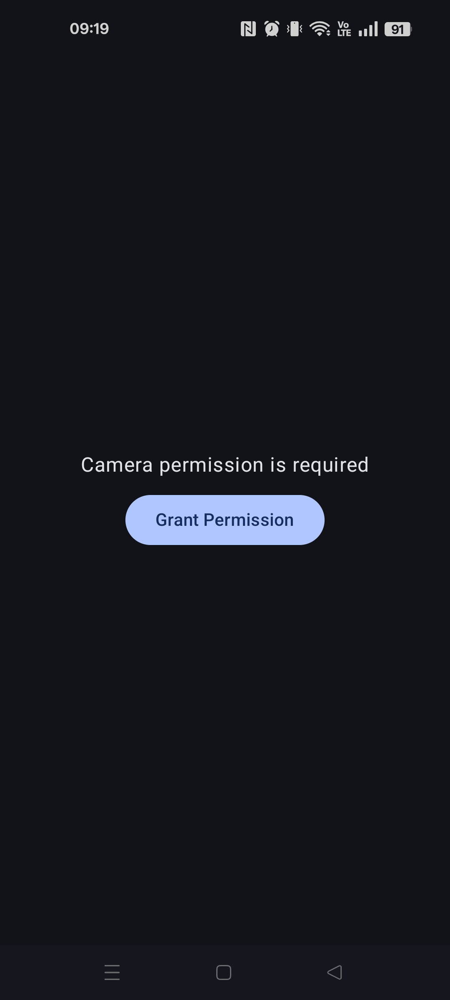
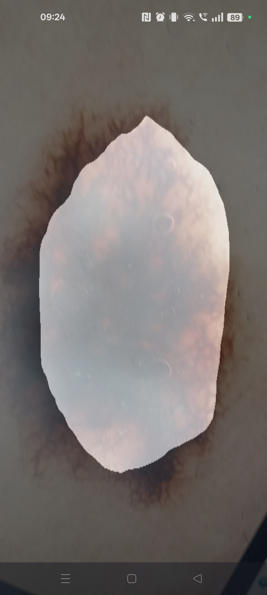
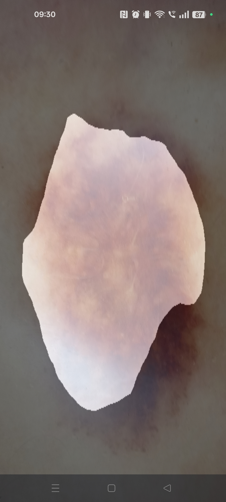

# Skin Lesion Segmentation — Android App

Real-time skin lesion segmentation on Android using a PyTorch Mobile model and CameraX. Point your camera at a skin lesion and the app overlays a segmentation mask live on the preview.

> **Related repository:** Model training & export scripts →
> [Persi00/Skin-Lesion-Segmentation](https://github.com/Persi00/Skin-Lesion-Segmentation)

---

## Screenshots

| Permission screen | Lesion segmentation | Lesion segmentation |
|:---:|:---:|:---:|
|  |  |  |

---

## Features

- Live camera feed with real-time segmentation overlay
- On-device inference — no internet connection required
- Binary segmentation: **background** vs. **lesion** (2 output classes)
- Semi-transparent mask rendered directly on the camera preview
- Built with Jetpack Compose, CameraX, and PyTorch Mobile Lite

---

## Requirements

- Android **7.0+ (API 24+)**
- Physical device recommended (emulator has limited camera support)
- Android Studio **Hedgehog or newer**

---

## Project Structure

```
app/src/main/
├── assets/
│   └── model.ptl                  # Pre-trained PyTorch Lite model (bundled)
└── java/com/example/skincancerscannerapp/
    ├── MainActivity.kt            # Compose UI, camera setup, permission handling
    └── SegmentationModel.kt       # Model loading, preprocessing, inference
```

---

## Model Setup

A pre-trained `model.ptl` is already bundled in `app/src/main/assets/` and the app works out of the box without any additional steps.

### Replacing the model

If you want to retrain or export a new model, use the dedicated export script from the training repository:

👉 [Persi00/Skin-Lesion-Segmentation](https://github.com/Persi00/Skin-Lesion-Segmentation)

```bash
# In the training repository
python tomobile.py
```

This produces a `model.ptl` file. To use it in the app, overwrite the existing file:

```
app/src/main/assets/model.ptl
```

### Model parameters

| Parameter | Value |
|---|---|
| Input size | 512 × 512 |
| Input channels | 3 (RGB) |
| Output classes | 2 (background, lesion) |
| Normalization mean | `[0.485, 0.456, 0.406]` |
| Normalization std | `[0.229, 0.224, 0.225]` |
| Output format | `OrderedDict` with key `"out"`, shape `[1, 2, H, W]` |

---

## Getting Started

1. **Clone the repository**
   ```bash
   git clone https://github.com/Persi00/skin-cancer-scanner-app.git
   cd skin-cancer-scanner-app
   ```

2. **Open in Android Studio**
   Open the project folder and let Gradle sync.

3. **Run on device**
   Connect an Android device with USB debugging enabled, select it in the device
   dropdown, and click ▶ Run. Grant camera permission when prompted.

---

## Dependencies

Managed via `gradle/libs.versions.toml`:

| Library | Purpose |
|---|---|
| `androidx.camera:camera-*` | CameraX — live preview & frame analysis |
| `org.pytorch:pytorch_android_lite` | PyTorch Mobile Lite runtime |
| `org.pytorch:pytorch_android_torchvision_lite` | Image tensor utilities |
| `com.google.accompanist:accompanist-permissions` | Runtime camera permission handling |
| Jetpack Compose | UI framework |

---

## How It Works

1. **Camera permission** is requested at runtime via Accompanist.
2. **CameraX `ImageAnalysis`** delivers frames to a background thread.
3. Each frame is resized to **512×512** and normalized, then converted to a float tensor.
4. The tensor is passed to the **PyTorch Lite model** for inference.
5. The model returns an `OrderedDict`; the `"out"` key contains a `[1, 2, H, W]` tensor.
6. **Argmax** per pixel selects class 0 (background) or class 1 (lesion).
7. The class map is converted to a **colored Bitmap** and overlaid on the preview at 50% opacity.

---

## Troubleshooting

**`IllegalStateException: Expected IValue type Tensor, actual type DictStringKey`**
The model returns a dictionary (common with torchvision models like DeepLab/FCN).
Fix: use `.toDictStringKey()["out"]!!.toTensor()` instead of `.toTensor()` directly.

**App crashes on first launch**
Make sure `model.ptl` is present in `app/src/main/assets/` and Gradle has synced.

**Preview freezes**
Ensure `imageProxy.close()` is always called after each frame, even on error (use `finally`).

**Wrong segmentation output**
Verify that `INPUT_WIDTH`, `INPUT_HEIGHT`, `MEAN`, and `STD` in `SegmentationModel.kt`
exactly match the values used during training.

---

## License

Copyright 2026 Persi00

Licensed under the Apache License, Version 2.0 (the "License");
you may not use this file except in compliance with the License.
You may obtain a copy of the License at

    http://www.apache.org/licenses/LICENSE-2.0

Unless required by applicable law or agreed to in writing, software
distributed under the License is distributed on an "AS IS" BASIS,
WITHOUT WARRANTIES OR CONDITIONS OF ANY KIND, either express or implied.
See the License for the specific language governing permissions and
limitations under the License.
